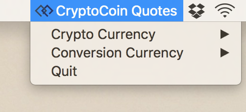
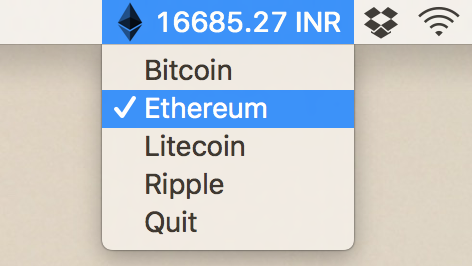
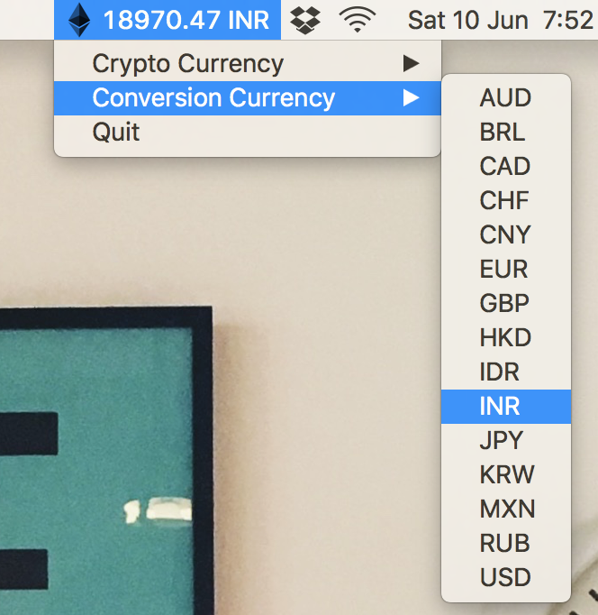

# CryptoCoin Quotes

Get up to date crypto currency quotes from the comfort of your status bar !

Steps :
------
Launch the app, (`python statusbarclient.py`)

Choose a crypto currency,

Choose a currency to convert to,

And that's it !

For your viewing pleasure,

Dependencies :
-------------
- [requests](http://docs.python-requests.org/en/master/)
- [rumps](http://rumps.readthedocs.io/en/latest/)

Using conda, build an identical environment with `conda env create -f environment.yml`

:octocat:
